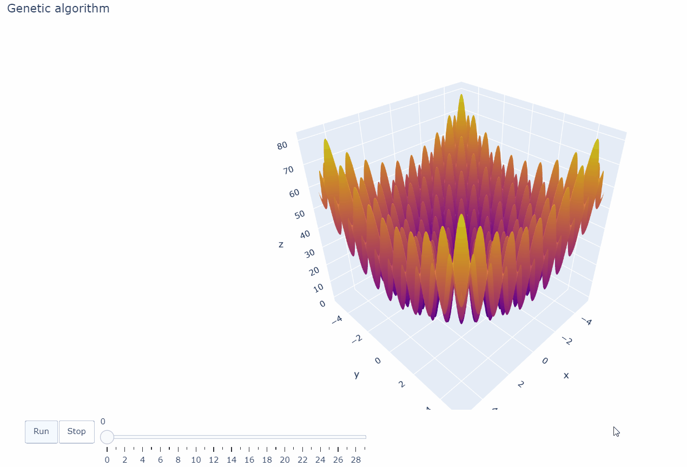

# Genetic algorithm
Building a simple Genetic algorithm from sratch (more or less) and using it to find global extreme on Rastrigin function. Using modul nympy for arrays and Plotly for interactive visualization.

